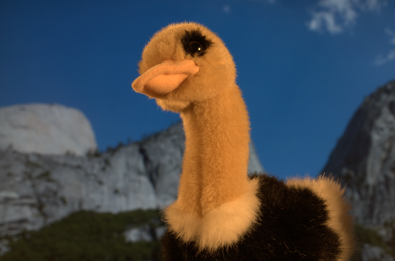

# Deep Image Matting

This is Chainer implementation of the paper **Deep Image Matting**

<p align="center"></p>

## Example Results
Evolution of matte as training progresses
<p align="center"></p>

For other experimental results check them out at the bottom of this page.

## Installation
It's recommended to use anaconda environment.

### Requirements
- Linux
- Python 3
- chainer (4.3.1)
- cupy (4.3.0)
- scikit-image (0.13.0)

1. Install **chainer** and **cupy** from [here](https://docs.chainer.org/en/stable/install.html)
2. Install the other requirements using `pip`

## Usage

### Directory structure
```bash
/path/to/DIM
         |-> ckpt/
         |     |---> demo.npy           # Checkpoint files are loaded from here
         |-> nnet/
         |     |---> model.py           # Builds graph of the neural network
         |-> scripts/
         |     |---> train.sh           # Training script
         |     |---> demo.sh            # Demo script
         |     |---> test_functions.sh  # Testing utils script
         |-> tests/
         |     |---> test_utils.py      # Tests for utils
         |-> utils/
         |     |---> utils.py           # common utility functions
         |     |---> loader.py          # Core loader for training
         |-> demo.py                    # Demo file
         |-> options.py                 # Set command line options
         |-> train.py                   # Train file
```

```bash
git clone https://github.com/kvmanohar22/DIM.git
cd DIM
```
Append root of this directory to `PYTHONPATH` environment variable

```export PYTHONPATH=$PYTHONPATH:/path/to/DIM_directory/```

### Demo
`bash ./scripts/demo.sh`

The above script gives you a demo of images in `img` directory.

### Full list of options
```
$ python demo.py --help
usage: demo.py [-h] [--dataset_root DATASET_ROOT] [--log_root LOG_ROOT]
               [--H H] [--W W] [--train_mode] [--max_epochs MAX_EPOCHS]
               [--batch_size BATCH_SIZE] [--base_lr BASE_LR]
               [--gpu_id GPU_ID] [--ckpt_frq CKPT_FRQ] [--alpha ALPHA]
               [--epsilon EPSILON] [--ckpt_path CKPT_PATH]
               [--img_path IMG_PATH] [--tri_path TRI_PATH]

optional arguments:
  -h, --help            show this help message and exit
  --dataset_root DATASET_ROOT
                        Root of dataset directory
  --log_root LOG_ROOT   Directory to log data
  --H H
  --W W
  --train_mode
  --max_epochs MAX_EPOCHS
  --batch_size BATCH_SIZE
  --base_lr BASE_LR
  --gpu_id GPU_ID
  --ckpt_frq CKPT_FRQ   Frequency at which checkpoints are generated
  --alpha ALPHA         Alpha value to weigh two types of losses
  --epsilon EPSILON     Small value used in loss computation
  --ckpt_path CKPT_PATH
                        Path to Checkpoint
  --img_path IMG_PATH   Path to Image
  --tri_path TRI_PATH   Path to Trimap
```

If you want to test on a custom image, then run the following:
`bash ./scripts/demo.sh path_to_image path_to_trimap`

### Train
You can use the following script to train your custom dataset. The data directory should be as follows:

```bash
/path/to/data
      |-> input/                # Image directory
      |     |-> img_0.png
      |     |-> img_1.png
      |     |-
      |     |-> img_X.png
      |-> gt/                   # Ground truth alpha mattes
      |     |-> img_0.png
      |     |-> img_1.png
      |     |-
      |     |-> img_X.png
      |-> trimap/               # Trimaps
      |     |-> trimap_dir1/
      |     |     |-> img_0.png
      |     |     |-> img_1.png
      |     |     |-
      |     |     |-> img_X.png
      |     |-> trimap_dir2/
      |     |     |-> img_0.png
      |     |     |-> img_1.png
      |     |     |-
      |     |     |-> img_X.png
```

`bash ./scripts/train.sh path_to_root_of_train_dataset`

To set more options, check out the `options.py` file and set them accordingly in `scripts/train.sh`

## Experiments
### Variation of loss with different learning rate schemes
<p align="center"></p>

<a name='examples'></a>
### Experimental results
From left to right. Background image, fore-ground image, predicted alpha matte, predicted blended image.
<div class="fig figcenter fighighlight">
   
  
  
  
</div>
<div class="fig figcenter fighighlight">
   
  
  
  
</div>
<div class="fig figcenter fighighlight">
   
  
  
  
</div>
<div class="fig figcenter fighighlight">
   
  
  
  
</div>

## Things which I tried that worked / did not work
- Using Xavier initialization (as suggested in the paper) for decoder network started producing `nan`s
- The paper also suggests to use constant learning rate of `1e-5`. But the training didn't converge
- Mean subtraction of images does produce comparatively good results
